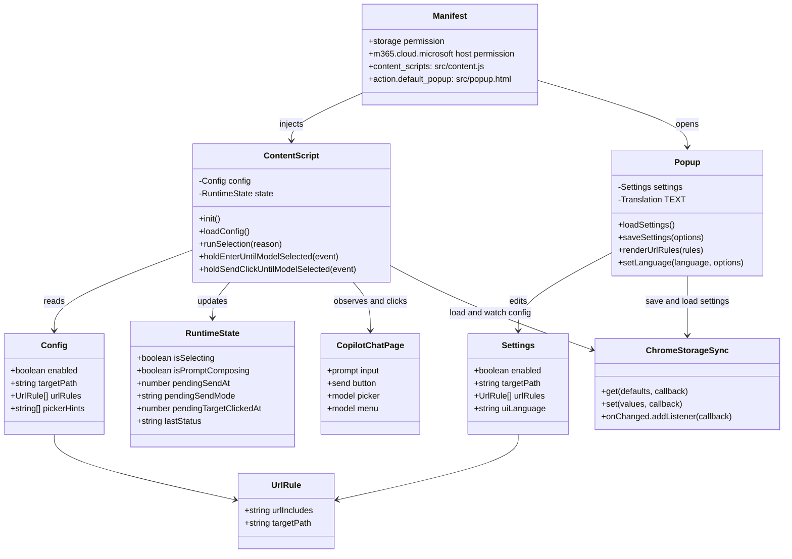

# Class Diagram

この拡張はクラスを定義せず、`content.js` と `popup.js` の関数群で構成する。
ここでは、保守時に参照しやすいように主要な責務とデータ構造の関係を示す。

## Responsibilities

- `content.js`: Copilot Chat の送信操作を一時保持し、設定に応じてモデルを選択してから送信する。
- `popup.js`: ポップアップ UI で設定を読み書きし、URL 別ルールや表示言語を管理する。
- `chrome.storage.sync`: ポップアップとコンテンツスクリプト間で共有する設定の保存先。
- `UrlRule`: URL に含まれる文字列と、その URL で使う選択パスを表す。`targetPath` が空の場合は、その URL で自動選択を無効にする。
